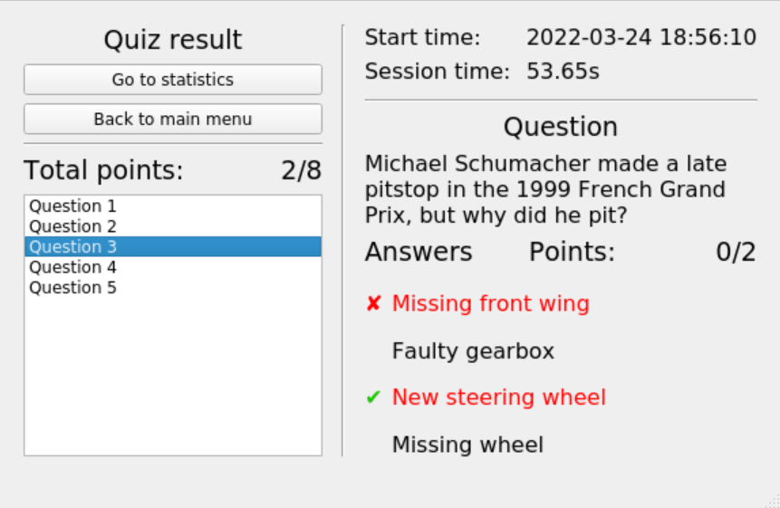

# Projekt - aplikacja do quizów

## Członkowie zespołu
[Bartłomiej Ściseł](https://github.com/bscisel)  
[Natalia Pieśniewska](https://github.com/Natalia-piesn)

## Funkcjonalność

- Tworzenie pliku bazy pytań w formacie JSON.
- Dodawanie kategorii i pytań do bazy.
- Tworzenie użytkowników biorących udział w quizie
- Zapisywanie danych, statystyk, historii rozwiązywania quizów do pliku w celu ich późniejszej analizy
- Losowanie pytań z bazy, możliwość rozwiązania quizu + podsumowanie
- Podliczanie punktacji oraz wyróżnianie błędnych i poprawnych odpowiedzi

## W projekcie wykorzystano

- C++
- [Qt5](https://www.qt.io/) - do graficznego interfejsu użytkownika
- [GoogleTest](https://github.com/google/googletest) - do testów jednostkowych logiki aplikacji
- [Doxygen](https://www.doxygen.nl/index.html) - dokumentacja kodu

## Zrzuty ekranu

